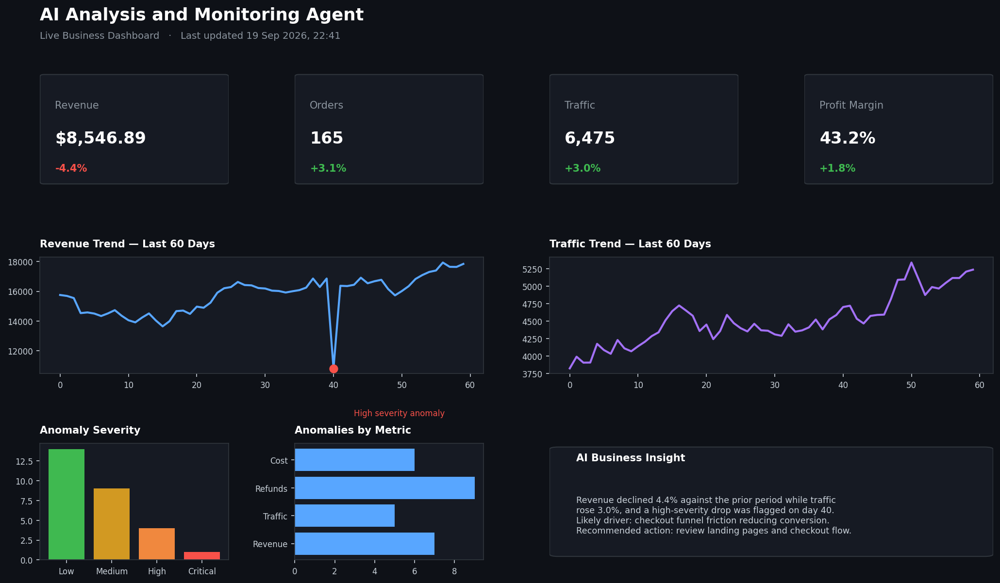
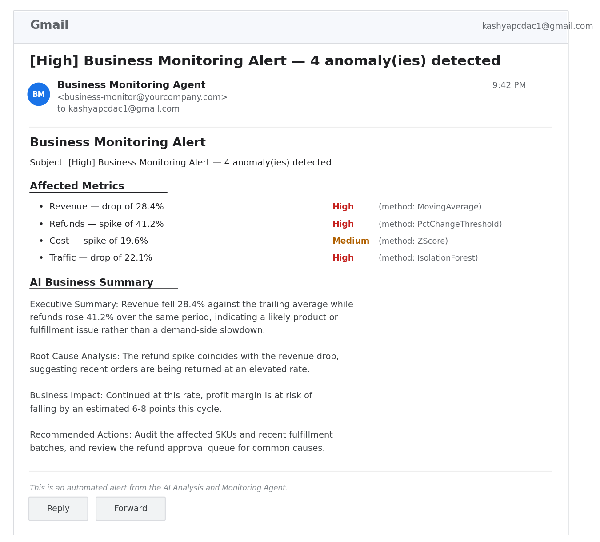

# AI Analysis and Monitoring Agent

An end-to-end, portfolio-ready system that monitors business metrics from Excel files,
detects anomalies with four independent methods, explains *why* they happened with a
25+ rule business logic engine, generates an executive-style summary using a local LLM
(Ollama — llama3.1:8b), emails alerts for critical issues, persists everything to
a database, and visualizes it all on an interactive dashboard.

Everything runs from a **single Python file — `app.py`** — which acts as both the
FastAPI backend and the Streamlit dashboard, depending on how it's launched.

---

## 📸 Dashboard



*KPI cards, revenue/traffic trends, anomaly severity distribution, and the
AI-generated business insight panel.*

## 📧 Alert Notification



*Automated High/Critical severity email alert delivered to the monitoring
authority's inbox, with affected metrics, severity, and the AI-generated
business summary.*

---

## 🏗️ Architecture

```
                ┌──────────────────┐
                │   Excel Upload    │
                └────────┬─────────┘
                         │
                ┌────────▼─────────┐
                │  Ingestion +      │
                │  Cleaning Module  │
                └────────┬─────────┘
                         │
                ┌────────▼─────────┐
                │  KPI Calculation  │
                │      Engine       │
                └────────┬─────────┘
                         │
         ┌───────────────┼───────────────┐
         │               │               │
┌────────▼───────┐┌──────▼───────┐┌──────▼────────┐
│ Anomaly Engine  ││ Business Rule││  AI Insight    │
│ (MA / %Δ / Z /  ││    Engine    ││ Generator      │
│ Isolation Forest)││ (25+ rules) ││ (Ollama LLM)   │
└────────┬───────┘└──────┬───────┘└──────┬────────┘
         │               │               │
         └───────────────┼───────────────┘
                         │
               ┌─────────▼─────────┐
               │  Email Alerts +   │
               │  Database (SQL)   │
               └─────────┬─────────┘
                         │
              ┌──────────┴───────────┐
              │                      │
      ┌───────▼───────┐     ┌────────▼────────┐
      │ FastAPI Backend│     │ Streamlit UI    │
      │ (Swagger docs) │     │ (Dashboard)     │
      └────────────────┘     └─────────────────┘
```

---

## ✨ Features

- **Excel ingestion & cleaning** — validates columns, fixes bad dates, removes
  duplicates, imputes missing values, clips outliers (IQR method).
- **KPI engine** — revenue/order/traffic growth %, refund rate, profit margin,
  cost ratio, conversion rate trend.
- **4-method anomaly detection** — Moving Average, Percentage Change Threshold,
  Z-Score, and Isolation Forest (scikit-learn) — each anomaly gets a severity
  (`Low` / `Medium` / `High` / `Critical`) and direction (`spike` / `drop`).
- **Business Rule Engine** — 25+ human-readable rules (e.g. "Revenue dropped
  while traffic increased" → funnel/conversion issue).
- **AI Insight Generator** — calls a local Ollama model (`llama3.1:8b`) to
  produce an Executive Summary, Root Cause Analysis, Business Impact, and
  Recommended Actions. Falls back to a deterministic template if Ollama isn't
  running or the model hasn't been pulled yet, so the system never breaks.
- **Email alerts** — SMTP email automatically sent to the monitoring team for
  `High` / `Critical` anomalies, with affected metrics, severity, and the AI
  summary embedded in the message body.
- **Database persistence** — SQLAlchemy models for `metrics`, `anomalies`,
  `alerts`, `audit_logs`, and `users`. SQLite by default; swap in MySQL by
  changing one environment variable.
- **FastAPI backend** — `/upload`, `/metrics`, `/anomalies`, `/alerts`,
  `/summary`, `/dashboard-data`, with Swagger docs at `/docs`.
- **Streamlit dashboard** — KPI cards, revenue/traffic trend charts, anomaly
  table with filters (date/metric/severity), severity distribution, AI
  insights panel, alert history.
- **Test suite** — pytest tests covering cleaning, KPIs, anomaly detectors,
  the rule engine, and the full pipeline.
- **Sample data generator** — produces a realistic 365-day dataset with
  injected anomalies, so the pipeline can be exercised end-to-end immediately.

---

## 📂 Project Structure

```
AI Analysis and Monitoring Agent/
├── app.py                 # Everything: ingestion, cleaning, KPIs, anomaly
│                           # detection, rules, AI summary, email, DB models,
│                           # FastAPI backend, Streamlit dashboard
├── data/
│   └── sample_data.xlsx   # 365-day business dataset used to exercise the pipeline
├── images/
│   ├── dashboard_result_snapshot.png
│   └── alert_email_notification.png
├── tests/
│   └── test_app.py        # pytest suite
├── requirements.txt
├── .env.example
├── .gitignore
└── README.md
```

---

## 🚀 Installation

```bash
git clone https://github.com/<your-username>/AI-Analysis-and-Monitoring-Agent.git
cd "AI Analysis and Monitoring Agent"

python3 -m venv venv
source venv/bin/activate        # Windows: venv\Scripts\activate

pip install -r requirements.txt

cp .env.example .env            # then edit .env with your own settings
```

### Local LLM setup (for AI-generated summaries instead of the fallback template)

```bash
# Install Ollama: https://ollama.com
ollama pull llama3.1:8b
ollama serve
```

---

## ⚙️ Configuration

All configuration lives in `.env` (see `.env.example`):

| Variable | Purpose |
|---|---|
| `DATABASE_URL` | SQLite by default; set a `mysql+pymysql://...` URL to use MySQL |
| `EMAIL_ENABLED` | `true`/`false` — turn SMTP alerts on/off |
| `SMTP_HOST` / `SMTP_PORT` / `SMTP_USER` / `SMTP_PASSWORD` | Your SMTP credentials |
| `ALERT_EMAIL_FROM` / `ALERT_EMAIL_TO` | Alert email addresses (`ALERT_EMAIL_TO` defaults to the monitoring team's address, `kashyapcdac1@gmail.com`) |
| `OLLAMA_HOST` / `OLLAMA_MODEL` | Local LLM settings (default model: `llama3.1:8b`) |

---

## ▶️ Usage

**Generate sample data:**
```bash
python app.py --make-sample-data
```

**Run the FastAPI backend:**
```bash
python app.py
# or:
uvicorn app:api --reload
```
Swagger docs: http://localhost:8000/docs

**Run the Streamlit dashboard:**
```bash
streamlit run app.py
```
Then upload `data/sample_data.xlsx` (or click "Use Sample Data" in the sidebar).

**Run the tests:**
```bash
pytest tests/ -v
```

---

## 📡 API Documentation

| Method | Endpoint | Description |
|---|---|---|
| `POST` | `/upload` | Upload an Excel file, runs the full pipeline |
| `GET` | `/metrics` | Recent cleaned metric rows |
| `GET` | `/anomalies` | Detected anomalies (filter by `severity`) |
| `GET` | `/alerts` | Alert history |
| `GET` | `/summary` | Latest AI summary + rule insights |
| `GET` | `/dashboard-data` | Full latest pipeline result |

Interactive docs auto-generated by FastAPI are available at `/docs` once the
server is running.

---

## 🔮 Future Improvements

- Scheduled automation via cron or an Airflow DAG (hourly ingestion → detection
  → alerting) instead of manual upload.
- Role-based authentication using the existing `users` table.
- Multi-tenant support for monitoring several businesses/data sources at once.
- Model registry to swap in fine-tuned anomaly-detection models per metric.
- Slack/Teams alert channel in addition to email.

---

## 💼 Resume Bullet Points

- Built an end-to-end business monitoring platform in Python that ingests
  Excel data, detects anomalies with four statistical/ML methods (Moving
  Average, % Change, Z-Score, Isolation Forest), and generates AI-written
  executive summaries via a locally hosted LLM (Ollama).
- Designed a 25+ rule business logic engine translating multi-metric
  statistical patterns (revenue, traffic, cost, refunds) into plain-English
  root-cause explanations for non-technical stakeholders.
- Implemented a FastAPI backend with SQLAlchemy-backed persistence
  (SQLite/MySQL) and a Streamlit dashboard for real-time KPI, anomaly, and
  alert visualization.
- Automated SMTP email alerting for high-severity business anomalies, reducing
  manual monitoring effort.

---

## 🐙 Push This Project to GitHub (Ubuntu Terminal)

Run these commands from inside the project folder:

```bash
# 1. Move into the project directory (quote the path — it has spaces)
cd "AI Analysis and Monitoring Agent"

# 2. Initialize git (skip if already a git repo)
git init

# 3. Configure your identity (skip if already set globally)
git config user.name "Your Name"
git config user.email "your_email@example.com"

# 4. Stage all files
git add .

# 5. Commit
git commit -m "Initial commit: AI Analysis and Monitoring Agent"

# 6. Rename branch to main (GitHub's default)
git branch -M main

# 7. Create a new EMPTY repository on GitHub first
#    (github.com -> New repository -> name it "AI-Analysis-and-Monitoring-Agent"
#     -> GitHub replaces spaces with hyphens in the repo name automatically,
#        your local folder can keep the spaced name
#     -> do NOT initialize with README/license, since you already have one)

# 8. Link your local repo to the GitHub repo (replace <your-username>)
git remote add origin https://github.com/<your-username>/AI-Analysis-and-Monitoring-Agent.git

# 9. Push
git push -u origin main
```

If GitHub asks for a password, use a **Personal Access Token** instead of your
account password (GitHub → Settings → Developer settings → Personal access
tokens → Generate new token, scope: `repo`).

**If the remote already has commits (e.g. auto-created README) and push is rejected:**
```bash
git pull origin main --allow-unrelated-histories
git push -u origin main
```

**To push future changes:**
```bash
git add .
git commit -m "Describe your change"
git push
```
